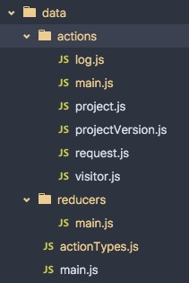

Redux 提供的主要功能：全局数据管理，包括数据的更新、存储、数据变化通知。 Redux 的 store 中存放了当前应用的状态，可以根据这个状态完整恢复出当前应用的界面，因此在使用 Redux 的项目中，可以实现一个比较炫酷的功能：依据状态的前进、后退。
<!-- more -->

Redux 中主要有三大块：

* Action：指代引起 Redux 中数据变化的操作；
* Reducer：响应 Action 操作，修改 Redux 中的数据；
* Store：包含一个 state 对象，用于存放整个应用的数据，并整合将 Action 和 Reducer 整合起来，修改 Store 中的数据。

目前，网上已经有很多中文资料介绍具体概念细节以及相关 API 了，比如：

* [Redux 中文文档](http://cn.redux.js.org/)
* [React 数据流管理架构之 Redux 介绍](http://www.alloyteam.com/2015/09/react-redux/)

这里主要想记录一下作为一个初学 Redux 的菜鸟，使用过程中的心得体会。

单单就 Redux 本身来看，并不能直接用于生产，太灵活了，有很多“套路”需要强制定下来：

* 怎么设计 state 对象的数据结构？怎么分好模块？怎么规定各个模块的命名风格？
* Redux 只提供了注册 state 变化回调函数的 API ，如果只想监听其中某一个数据的变化该怎么办？
* 如果在 state change 的回调函数中再次 dispatch Action ，就可能造成无限递归，怎么设计才能很好地避免这种无限递归？
* 如何设计组织项目代码才更好维护？
* 如何避免写大量重复的 Action 、 Reducer 代码？

# 划分代码目录

目录的划分方式有多种，可以按照项目的功能模块，也可以按照 Redux 的职责模块。我选择了后者，采用的目录结构如下：



外部可以直接引入的 JS 模块只能是 `data/main` 和 `data/actionTypes` 。

# 解决递归调用

为什么会有递归调用呢？参考如下代码：

```js
import {createStore} from 'redux';

function reducer(state = {}, action) {
  switch (action.type) {
    case 'SOME_THING_LOAD_COMPLETE':
        return Object.assign({}, state, {
            loadComplete: true
        });
    default:
        return state;
  }
}

let store = createStore(reducer);

store.subscribe(() =>

    // do something here.

    store.dispatch({type: 'SOME_THING_LOAD_COMPLETE'});
);

store.dispatch({type: 'SOME_THING_LOAD_COMPLETE'});
```

上面这个简单的例子很清晰地说明了无限递归的问题，在实际开发中，由于业务逻辑的复杂纠缠，这个递归过程可能非常间接、隐蔽，造成 debug 困难。那么如何有效避免呢？

一个比较常用的方法就是检查对应数据是否真的发生了变化，比如上面的代码可以改为：

```js
import {createStore} from 'redux';

function reducer(state = {}, action) {
  switch (action.type) {
    case 'SOME_THING_LOAD_COMPLETE':
        return Object.assign({}, state, {
            loadComplete: true
        });
    default:
        return state;
  }
}

let store = createStore(reducer);

let previousLoadComplete;
store.subscribe(() =>

    // do something here.

    let currentLoadComplete = store.getState().loadComplete;
    if (currentLoadComplete !== previousLoadComplete) {
        store.dispatch({type: 'SOME_THING_LOAD_COMPLETE'});
        previousLoadComplete = currentLoadComplete;
    }
);

store.dispatch({type: 'SOME_THING_LOAD_COMPLETE'});
```

由于 state 每次更新都会在相应位置产生一个新对象，所以只需要用全等来判断就行了。

# 组织 state 数据结构

如何划分 state 对象的结构呢？可能每个人根据自己的经验，都有自己的一套划分方式。此处我采用了与业务功能模块对齐的原则。

比如，我的项目里面有这样一些页面：用户列表页面、用户详情页面、资源页面、资源详情页面，那么 state 对象的结构为：

```js
state = {
    'user.list': { ... },
    'user.detail': { ... },
    'resource.list': { ... },
    'resource.detail': { ... }
}
```

结构扁平化了。

个人建议，不要使用“多层”的 state 结构，比如把上面的例子设计成：

```js
// BAD
state = {
    user: {
        list: { ... },
        detail: { ... }
    },
    resource: {
        list: { ... },
        detail: { ... }
    }
};
```

过深的结构会带来不必要的复杂度。

# 扩展事件监听方式

Redux 只提供了 `subscribe` 方法来监听 state 的变化，在实际开发中，某一个组件可能只对某部分 state 变化感兴趣。所以，应当适当地做一下扩展：

```js
export default class StateWatcher {

    /**
     * 存放监听回调函数等
     *
     * @private
     * @type {Array.<Object>}
     */
    watcherList = [];

    /**
     * 构造函数
     *
     * @constructor
     * @param {store} Store  Redux store实例
     */
    constructor(store) {
        this.store = store;
        // 存放之前 state
        this.previousStoreState = extend({}, this.store.getState());
        this.subscribe();
    }

    /**
     * 订阅 store 中 state 变化事件，会去检查 watcherList 中是否存在相应数据变化的回调函数
     *
     * @private
     */
    subscribe() {
        let me = this;
        this.unsubscribe = this.store.subscribe(function () {
            let currentStoreState = me.store.getState();
            let changedPropertyNameList = [];
            let delayFns = [];

            // 遍历 watcherList ，查找注册的回调函数
            each(me.watcherList, watcher => {
                let propertyName = watcher.propertyName;
                let previous = me.previousStoreState[propertyName];

                if (currentStoreState[propertyName] !== previous) {
                    changedPropertyNameList.push(propertyName);
                    // 这里 context 对应的是某个组件，如果组件销毁了，就没有必要调用相应回调函数了。
                    if (!watcher.context.isInStage(componentState.DESTROIED)) {
                        // 回调函数得延迟执行，因为回调函数是不可控的，在回调函数中可能又 dispatch 另外的 action ，
                        // 那就相当于此次 action 还没处理完，新的又来了，容易造成莫名其妙的错误。
                        // 所以要秉承处理完当前 action 的前提下，才能处理下个 action 的原则。
                        delayFns.push(() => {
                            watcher.watcherFn.call(
                                watcher.context,
                                propertyName,
                                currentStoreState[propertyName],
                                previous
                            );
                        });
                    }
                }
            });

            // 统一更新属性
            each(changedPropertyNameList, propertyName => {
                me.previousStoreState[propertyName] = currentStoreState[propertyName];
            });

            // action 处理完之后，统一调用延迟函数。
            each(delayFns, fn => fn());
        });
    }

    /**
     * 添加属性变化的回调函数
     *
     * @public
     * @param {string} propertyName 属性名
     * @param {Function} watcherFn 回调函数
     * @param {Component} context 组件
     */
    addWatcher({propertyName, watcherFn, context}) {
        this.watcherList.push({propertyName, watcherFn, context});
    }

    /**
     * 移除属性变化的回调函数
     *
     * @public
     * @param {string} propertyName 属性名
     * @param {Function} watcherFn 回调函数
     * @param {Component} context 组件
     */
    removeWatcher({propertyName, watcherFn, context}) {
        this.watcherList = filter(this.watcherList, watcher => {
            return watcher.propertyName !== propertyName
                || watcher.watcherFn !== watcherFn
                || watcher.context !== context;
        });
    }

    /**
     * 销毁
     *
     * @public
     */
    destroy() {
        this.unsubscribe();
    }
}
```

# 避免写重复代码

目前想到的，就只是抽离复用代码，形成 helper 方法之类的。

# 最后

本文所述方案仅供参考，算是我初次使用 Redux 所想到的一些“套路”，不对之处静候读者指出，共同探讨。
